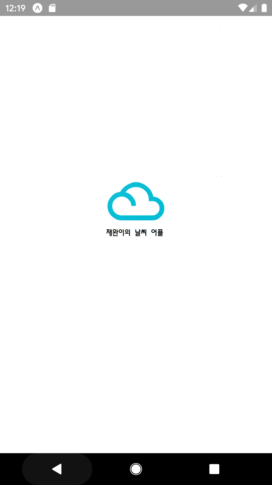

# 12조 React Native Assignment

- 시연 영상입니다.
  


- 먼저  splash 화면 입니다. 앱이 처음 구동될때 몇초간 나타나는 화면을 구현 하였습니다.
  

  

- 홈화면으로 현재 날씨를 볼 수 있는 도시의 이름들이 알파벳 순으로 정렬되어 리스트로 나타납니다.
  


- 도시이름을 누르면 화면이 바뀌고, 선택된 도시의 현재 날씨 데이터를 서버나, API를 통해 가져오는동안 loading gif를 이용하여 직관적인 로딩상태를 나타냅니다.


- 현재 날씨에 대한 정보를 사용자에게 나타내는 화면입니다. 
	
	- 
		
	- 먼저  아래의 코드 처럼 openweathermap site에서 제공하는 icon API를 사용하였습니다.따라서, `this.state.weather[0].icon`의 값에 따라 이미지가 달라집니다.
	
	  ```javascript
	  <Image style={{ width: 200, height: 150}} source={{uri: 'http://openweathermap.org/img/wn/'+this.state.icon+'@2x.png'}} />
	  ```
	
	- 그 밑에는 현재기온, 최저, 최고 기온, 기압, 풍속, 및 습도에 대한 정보를 제공합니다.
	
	- 마지막으로 "우산 안 챙겨도 돼요", 또는 "우산 좀 챙기라고"라는 메시지를 통해 사용자들에게 우산의 필요 여부를 알려주며 하단에는 비가오지 않을 시 태양모양의 gif를, 비가 내릴 시 우산과 비가내리는 풍경의 gif를 넣어 메시지를 더욱 강조 하였습니다.
	
	- 아래는 현재 비가 내릴시 현재 날씨 정보 제공 화면입니다.
	
	- 


- 상기 시연 모습들은 원래의 코드에선 spring server가 localhost에서 작동하고,  대전의 날씨 정보만 나오므로 아래와 같은 코드로 직접 openweathermap site의 API를 사용하여 도시의 현재날씨를 가져옵니다.

  ```javascript
  componentDidMount() {
          const city = this.props.navigation.getParam('city', null);
          // const city = 'Daejeon';
  
          fetch(`http://api.openweathermap.org/data/2.5/weather?	    q=${city}&appid=78e00047d7bce6188096b68c5823fd7f`)
              .then(response => response.json())
              .then(info => {
                  this.setState({
                      ...info,
                      isLoading: false,
                  });
              });
  
      }
  ```

  